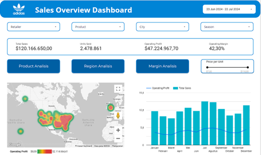

# Analisis Kinerja Penjualan Adidas US & Dashboard Interaktif Looker Studio

Sebuah proyek analisis data *end-to-end* yang mengubah data penjualan mentah Adidas US (2020-2021) menjadi sebuah dashboard interaktif di Looker Studio. Proyek ini berfungsi sebagai studi kasus untuk mengidentifikasi tren penjualan, menganalisis performa produk, dan menemukan *insight* untuk rekomendasi bisnis.

## 🚀 Dashboard Interaktif

**[ >> [KLIK DI SINI UNTUK MEMBUKA DASHBOARD INTERAKTIF LOOKER STUDIO](https://lookerstudio.google.com/reporting/bca721cc-c904-479e-b908-b1d1accdd685) << ]**

### 📸 Screenshot Dashboard Utama (Sales Overview)
.

---

## 🎯 Konteks & Tujuan Proyek

### Konteks Bisnis
Perusahaan Global Adidas United States menghadapi tantangan dalam menganalisis data penjualan operasional skala besar. Mereka membutuhkan pemahaman mendalam tentang kinerja penjualan di berbagai wilayah untuk memahami tren, perilaku pelanggan, dan mengidentifikasi peluang pertumbuhan.

### Tujuan Analisis (Pertanyaan Bisnis)
Analisis ini dirancang untuk menjawab pertanyaan-pertanyaan kunci berikut:
1.  Bagaimana gambaran umum kinerja penjualan (Sales Overview) Adidas di US?
2.  Produk, wilayah (Region), dan metode penjualan mana yang paling menguntungkan?
3.  Bagaimana performa margin operasional dan hubungannya dengan total penjualan? 

## 🛠️ Tech Stack (Alat yang Digunakan)

* **Sumber Data:** [Dataset Adidas US Sales dari Kaggle (2020-2021)](https://www.kaggle.com/datasets/heemalichaudhari/adidas-sales-dataset/data).
* **Data Cleaning & Processing:** Python (menggunakan library Pandas & Numpy).
* **Data Analysis & EDA:** Python (Matplotlib, Seaborn, Plotly).
* **Data Visualization & Dashboard:** **Looker Studio** (sebelumnya Google Data Studio).

---

## ⚙️ Proses & Metodologi (CRISP-DM)

Proyek ini mengikuti metodologi standar industri, **CRISP-DM** (Cross-Industry Standard Process for Data Mining).

**1. Business Understanding**
* Memahami tujuan proyek seperti yang dijelaskan di Bab 1: Menganalisis kinerja penjualan Adidas US untuk menemukan *insight* yang dapat ditindaklanjuti.

**2. Data Understanding**
* Menganalisis dataset awal yang terdiri dari 13 kolom, termasuk `Retailer`, `Invoice Date`, `Product`, `Total Sales`, `Operating Profit`, dan `Operating Margin`.
* Melakukan *Exploratory Data Analysis (EDA)* dan menemukan korelasi positif yang sangat kuat (0.94) antara `Total Sales` dan `Operating Profit`.

**3. Data Preparation (Tahap Paling Krusial)**
* **Cleaning:** Melakukan pengecekan *missing value* (hasil: 0 *missing value*).
* **Normalization:** Menemukan dan memperbaiki data yang tidak konsisten. Kolom `Total Sales` dan `Operating Profit` dihitung ulang untuk memastikan akurasi data (`Total Sales` = `Price per Unit` * `Units Sold`; `Operating Profit` = `Total Sales` * `Operating Margin`).
* **Feature Engineering:** Membuat 6 kolom baru untuk analisis yang lebih mendalam, yaitu: `Week day`, `Month`, `Year`, `Season`, `Month Year`, `Type`, dan `Group` (kategori produk).
* Data bersih (19 kolom) diekspor untuk digunakan di Looker Studio.

**4. Modeling (Visualisasi)**
* Merancang dashboard di Looker Studio dengan memilih visualisasi yang tepat untuk setiap pertanyaan bisnis (misal: Bar Chart untuk perbandingan, Line Chart untuk tren, Peta/Heatmap untuk geografi, dan Bubble Chart untuk hubungan).

**5. Evaluation**
* Dashboard dievaluasi untuk memastikan semua metrik akurat, filter berfungsi dengan baik , dan *insight* dapat disampaikan dengan jelas.

**6. Deployment**
* Hasil akhir berupa dashboard interaktif yang dipublikasikan di Looker Studio dan dapat diakses publik.

---

## 💡 Temuan Kunci & Rekomendasi Bisnis

Analisis ini menghasilkan beberapa temuan kunci (*key insights*) yang dapat ditindaklanjuti oleh tim bisnis:

#### 1. Insight: Performa Produk Tidak Merata
* **Temuan:** Produk **"Men’s Street Footwear"** secara konsisten menjadi produk dengan penjualan tertinggi, jauh mengungguli kategori produk lainnya.
* **Rekomendasi Bisnis:**
    * **Marketing:** Prioritaskan anggaran pemasaran untuk mempromosikan kategori "Men’s Street Footwear".
    * **Inventori:** Pastikan ketersediaan stok yang optimal untuk produk ini, terutama di lokasi-lokasi dengan penjualan tinggi.

#### 2. Insight: Dominasi Penjualan Wilayah 'West'
* **Temuan:** Wilayah (Region) **"West"** memberikan kontribusi penjualan terbesar dibandingkan dengan wilayah lain seperti Northeast, Southeast, dll.
* **Rekomendasi Bisnis:**
    * **Alokasi Sumber Daya:** Alokasikan sumber daya (logistik, tim penjualan, iklan lokal) lebih besar untuk wilayah "West".
    * **Analisis Lanjutan:** Selidiki mengapa wilayah lain (misal: "South" atau "Midwest") memiliki performa lebih rendah. Apakah karena preferensi produk yang berbeda atau strategi penjualan yang kurang efektif?

#### 3. Insight: Margin Tinggi ≠ Profit Tertinggi
* **Temuan:** Melalui analisis *Bubble Chart* (Diagram Balon), ditemukan bahwa **rata-rata margin operasional yang tinggi pada suatu produk tidak secara otomatis menjamin profit operasional total yang tinggi**. Seringkali, produk dengan volume penjualan (Total Sales) sangat tinggi yang menjadi penyumbang profit terbesar, meskipun marginnya lebih tipis.
* **Rekomendasi Bisnis:**
    * **Fokus Strategi:** Jangan hanya berfokus pada produk *high-margin*. Gunakan dashboard untuk mengidentifikasi produk "volume driver" (penjualan tinggi) dan pastikan operasionalnya tetap efisien untuk memaksimalkan profit total.

#### 4. Insight: Pola Penjualan Musiman
* **Temuan:** Tren penjualan bulanan menunjukkan **puncak penjualan terjadi di bulan Juli dan Agustus**, dan titik terendah terjadi di sekitar bulan Februari-Maret.
* **Rekomendasi Bisnis:**
    * **Promosi:** Luncurkan kampanye promosi besar (contoh: "Summer Sale") menjelang Juli untuk memaksimalkan puncak penjualan.
    * **Stimulasi Permintaan:** Tawarkan *bundling* atau diskon khusus di bulan Februari/Maret untuk menstimulasi permintaan selama *low season*.

---

## 🗺️ Struktur Halaman Dashboard

Dashboard ini dirancang dengan 4 halaman utama untuk analisis yang spesifik dan efektif:

* **1. Sales Overview:** Berisi KPI utama (Total Sales, Units Sold, Operating Profit, Operating Margin), tren penjualan bulanan, dan heatmap profit berdasarkan kota.
* **2. Product Analysis:** Fokus pada analisis produk terlaris, pie chart unit terjual, dan tren penjualan bulanan.
* **3. Region Analysis:** Menampilkan analisis performa berdasarkan wilayah (Pie Chart), profit per kota (Geography Chart), dan tabel pivot penjualan bulanan per wilayah.
* **4. Margin Analysis:** Menganalisis margin berdasarkan negara bagian dan hubungan antara Total Sales vs Operating Margin (Bubble Chart).
